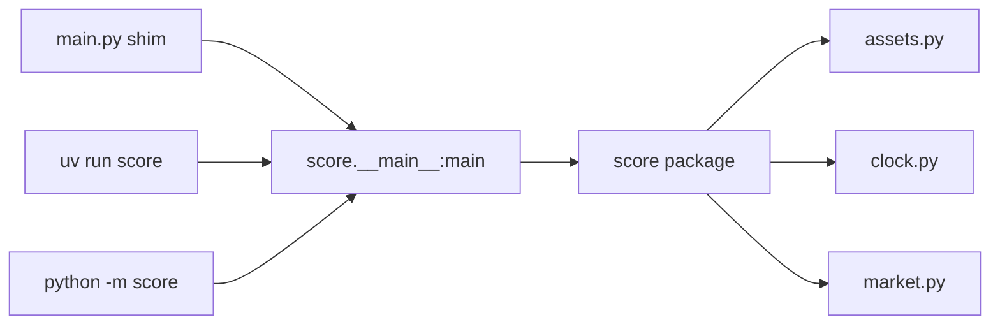

# Changelog

### 2026-07-11 — Added portfolio-optimization roadmap (deep-dive doc + generated Excalidraw board)

Authored a math+OOP roadmap toward portfolio optimization: a LaTeX deep-dive and a regenerable Excalidraw board.

Technical summary

**Motivation.** The user is rebuilding stats/probability/DE skills and wants a portfolio-optimization target that stays in step with the existing `Asset`/`Stock`/`Portfolio` Composite. The prior Excalidraw generator only survived on the `archive` branch (removed in the C++→Python pivot), so the tooling was rebuilt for the pure-Python project.

**Approach.** A declarative JSON spec drives a self-contained generator that emits an Excalidraw board (rounded-rectangle cards, bound text, dependency arrows). The deep-dive doc covers four phases — returns → statistics ($\Sigma$, $\beta$) → probability (VaR/CVaR, Monte Carlo) → Markowitz frontier and SDEs (GBM, OU, Black–Scholes) — each paired with the design pattern that lands it in the codebase (Value Object, Strategy, Visitor).

| File | Change |
|---|---|
| [roadmap/ROADMAP.md](roadmap/ROADMAP.md) | New — LaTeX/Mermaid deep-dive; math track × OOP/pattern track |
| [scripts/roadmap_boards.json](scripts/roadmap_boards.json) | New — declarative board spec (5 columns, 13 cards, 13 edges) |
| [scripts/gen_roadmap.py](scripts/gen_roadmap.py) | New — generator + `--selftest` structural validator |
| [roadmap/ROADMAP.excalidraw](roadmap/ROADMAP.excalidraw) | Generated — do not hand-edit |
| [CHANGELOG.md](CHANGELOG.md) | This entry |

The efficient-frontier objective the roadmap builds toward:

$$\min_{\mathbf{w}} \; \mathbf{w}^\top \Sigma\, \mathbf{w} \quad \text{s.t.} \quad \mathbf{w}^\top \boldsymbol{\mu} = \mu_{\text{target}}, \;\; \mathbf{w}^\top \mathbf{1} = 1.$$

**Verification.** `python scripts/gen_roadmap.py --selftest` → `13 cards, 13 edges, 46 elements`; regen writes valid JSON (re-parsed with `json.load`). Edge endpoints and text containers validated against the spec node set.

### 2026-07-10 — Reorganized into a `src/score` package with a thin runner

Split the monolithic `main.py` into a proper `src/`-layout Python package; `main.py` is now a thin runner.

Technical summary

**Motivation.** After the C++→Python pivot, all classes lived in a single `main.py`. That conflates the *library* (objects) with the *entry point* (runner), and blocks packaging/importing. Moving to a `src/score/` layout separates the two and makes `score` installable and importable.

**Approach.** Classes were grouped into cohesive modules and the package re-exports its public API from `__init__.py`. `main.py` became a shim delegating to the canonical runner `score.__main__:main`, which is also exposed as a console script (`uv run score`) and a module entry point (`python -m score`).

| File | Change |
|---|---|
| [src/score/clock.py](src/score/clock.py) | New — `Clock` time source (injectable) |
| [src/score/market.py](src/score/market.py) | New — `MarketData` yfinance facade with cached fetches |
| [src/score/assets.py](src/score/assets.py) | New — `Asset` / `Stock` / `Portfolio` (Composite pattern) |
| [src/score/__init__.py](src/score/__init__.py) | New — re-exports public API |
| [src/score/__main__.py](src/score/__main__.py) | New — canonical runner (`python -m score`, console script) |
| [main.py](main.py) | Reduced to a shim importing `score.__main__:main` |
| [pyproject.toml](pyproject.toml) | Added hatchling build backend, `src/score` wheel target, `score` console script, `pytest pythonpath=src` |
| [test_main.py](test_main.py) | Import path changed from `main` to `score` |

**Verification.** `uv sync` installs `score` editable; `pytest` 8/8 pass; all three runners (`uv run score`, `python -m score`, `python main.py`) print `My Portfolio: $3,153.30` against the live yfinance API.

