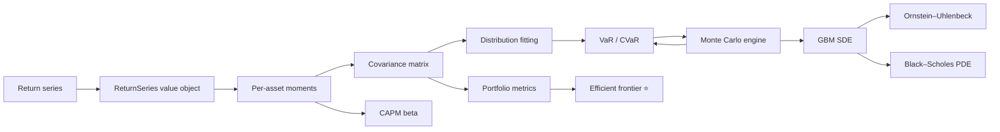

# SCORE — Portfolio Optimization Roadmap & Deep Dive

> The math track (statistics → probability → SDEs) and the software track
> (OOP + Composite + supporting design patterns) advance **together**. Each
> math capability lands as a well-shaped object that plugs into the existing
> `Asset` / `Stock` / `Portfolio` composite in [`src/score/assets.py`](../src/score/assets.py).
>
> Visual companion: [`ROADMAP.excalidraw`](./ROADMAP.excalidraw) — regenerate with
> `python scripts/gen_roadmap.py` (edit [`scripts/roadmap_boards.json`](../scripts/roadmap_boards.json), never the `.excalidraw` by hand).

---

## Dependency graph



---

## Phase 0 — Foundation: from prices to returns

Everything downstream runs on **returns**, not prices. Today
[`MarketData`](../src/score/market.py) fetches only `period="1d"`. Widen it to a
history window and derive returns.

Given a price series $P_0, P_1, \dots, P_T$:

$$
r_t^{\text{simple}} = \frac{P_t - P_{t-1}}{P_{t-1}}, \qquad
r_t^{\text{log}} = \ln\!\frac{P_t}{P_{t-1}}.
$$

Log returns are **time-additive** — the $k$-period return is just a sum,
$\ln(P_t / P_{t-k}) = \sum_{i=0}^{k-1} r_{t-i}^{\text{log}}$ — which is why every
model below assumes them.

### Software move — a `ReturnSeries` value object

Wrap the pandas `Series` in an **immutable value object** so returns are a
first-class domain type, not a bare array threaded through function signatures:

```python
class ReturnSeries:
    """Immutable log-return series. Value object: equality by content,
    no identity, arithmetic returns new instances."""
    def __init__(self, data): self._s = data.copy()
    def mean(self): ...
    def std(self): ...
    def __add__(self, other): ...   # portfolio aggregation
```

This keeps the **Single Responsibility Principle** intact: `MarketData` fetches,
`ReturnSeries` computes, `Stock` composes.

---

## Phase 1 — Statistics (the workhorse layer)

### Per-asset moments

Annualized from $N=252$ trading days:

$$
\hat\mu = \frac{1}{T}\sum_{t=1}^{T} r_t, \qquad
\hat\sigma^2 = \frac{1}{T-1}\sum_{t=1}^{T} (r_t - \hat\mu)^2,
$$

$$
\mu_{\text{ann}} = 252\,\hat\mu, \qquad \sigma_{\text{ann}} = \sqrt{252}\,\hat\sigma.
$$

Higher moments matter because returns are **not** Gaussian:

$$
\text{skew} = \mathbb{E}\!\left[\left(\tfrac{r-\mu}{\sigma}\right)^3\right], \qquad
\text{kurt} = \mathbb{E}\!\left[\left(\tfrac{r-\mu}{\sigma}\right)^4\right].
$$

Excess kurtosis $>0$ (fat tails) is the norm — it foreshadows Phase 2.

### Covariance matrix — the heart of diversification

For assets $i,j$:

$$
\Sigma_{ij} = \operatorname{Cov}(r_i, r_j) = \mathbb{E}\big[(r_i-\mu_i)(r_j-\mu_j)\big],
\qquad
\rho_{ij} = \frac{\Sigma_{ij}}{\sigma_i \sigma_j}.
$$

$\Sigma$ is symmetric positive-semidefinite. **Diversification is entirely a
statement about $\Sigma$'s off-diagonals**: two assets with $\rho_{ij} < 1$
combine to a variance *below* the weighted average of their variances.

### CAPM beta

Regress an asset's excess returns on the market's (e.g. `^GSPC`):

$$
\beta_i = \frac{\operatorname{Cov}(r_i, r_m)}{\operatorname{Var}(r_m)}.
$$

$\beta$ isolates **systematic** (undiversifiable) risk — the slope in
$r_i - r_f = \alpha_i + \beta_i (r_m - r_f) + \varepsilon_i$.

---

## Phase 2 — Probability (modeling & risk)

### Distribution fitting

Test Gaussian vs. Student-$t$. The $t$-density with $\nu$ degrees of freedom,

$$
f(x;\nu) = \frac{\Gamma\!\left(\frac{\nu+1}{2}\right)}{\sqrt{\nu\pi}\,\Gamma\!\left(\frac{\nu}{2}\right)}
\left(1 + \frac{x^2}{\nu}\right)^{-\frac{\nu+1}{2}},
$$

captures fat tails as $\nu \to$ small. Validate with a QQ-plot and a
Kolmogorov–Smirnov or $\chi^2$ goodness-of-fit test.

### Value at Risk / Conditional VaR

At confidence $1-\alpha$ (e.g. 95%):

$$
\operatorname{VaR}_\alpha = -\inf\{\, x : \mathbb{P}(R \le x) \ge \alpha \,\},
\qquad
\operatorname{CVaR}_\alpha = -\,\mathbb{E}[\,R \mid R \le -\operatorname{VaR}_\alpha\,].
$$

Parametric-Gaussian shortcut: $\operatorname{VaR}_\alpha = -(\mu + z_\alpha \sigma)$
with $z_{0.05} = -1.645$. CVaR (expected shortfall) is the coherent risk measure —
prefer it.

### Monte Carlo engine — Strategy pattern

Simulate $N$ future portfolio paths, then read VaR/CVaR off the empirical
distribution. The *path model* is a pluggable **Strategy**:

```python
class PathModel(ABC):
    @abstractmethod
    def simulate(self, s0, steps, n_paths): ...

class GBMModel(PathModel): ...          # Phase 4
class BootstrapModel(PathModel): ...    # resample historical returns
```

`MonteCarloVaR` depends on the `PathModel` **abstraction**, not a concrete
model — textbook **Dependency Inversion**.

---

## Phase 3 — Optimization (the capstone ⭐)

### Portfolio metrics

With weights $\mathbf{w}$ ($\sum_i w_i = 1$):

$$
\mu_p = \mathbf{w}^\top \boldsymbol{\mu}, \qquad
\sigma_p^2 = \mathbf{w}^\top \Sigma\, \mathbf{w}, \qquad
\text{Sharpe} = \frac{\mu_p - r_f}{\sigma_p}.
$$

The quadratic form $\mathbf{w}^\top \Sigma\, \mathbf{w}$ is where the linear
algebra pays off — and it maps directly onto your `Portfolio`, which already
holds children and can expose their weights.

### Markowitz efficient frontier

$$
\min_{\mathbf{w}} \; \mathbf{w}^\top \Sigma\, \mathbf{w}
\quad \text{s.t.} \quad
\mathbf{w}^\top \boldsymbol{\mu} = \mu_{\text{target}}, \;\;
\mathbf{w}^\top \mathbf{1} = 1.
$$

**Closed form** via Lagrangian (great by-hand exercise):

$$
\mathcal{L} = \mathbf{w}^\top\Sigma\mathbf{w}
- \lambda(\mathbf{w}^\top\boldsymbol{\mu} - \mu_\text{target})
- \gamma(\mathbf{w}^\top\mathbf{1} - 1),
\qquad
\frac{\partial \mathcal L}{\partial \mathbf w} = 2\Sigma\mathbf w - \lambda\boldsymbol\mu - \gamma\mathbf 1 = 0.
$$

Solving gives $\mathbf{w}^\star = \Sigma^{-1}(\lambda\boldsymbol\mu + \gamma\mathbf 1)$;
sweep $\mu_\text{target}$ to trace the frontier. Add no-short constraints
($w_i \ge 0$) and it becomes a QP for `scipy.optimize.minimize` (SLSQP).

### Software move — Visitor over the composite

Optimization traverses the whole `Portfolio` tree to gather each leaf's
$\mu$ and column of $\Sigma$. A **Visitor** keeps that traversal logic out of the
asset classes:

```python
class Asset(ABC):
    @abstractmethod
    def accept(self, visitor): ...

class WeightsVisitor:   # collects leaves + weights from a nested Portfolio
    def visit_stock(self, s): ...
    def visit_portfolio(self, p): ...
```

---

## Phase 4 — Stochastic differential equations

### Geometric Brownian Motion

The SDE underlying price modeling:

$$
dS_t = \mu S_t\, dt + \sigma S_t\, dW_t,
$$

with closed-form solution (via Itô's lemma on $\ln S_t$):

$$
S_t = S_0 \exp\!\left[\left(\mu - \tfrac{1}{2}\sigma^2\right)t + \sigma W_t\right].
$$

Numerically, **Euler–Maruyama** with step $\Delta t$ and $Z_k \sim \mathcal N(0,1)$:

$$
S_{k+1} = S_k + \mu S_k \Delta t + \sigma S_k \sqrt{\Delta t}\; Z_k.
$$

This *is* the engine behind the Phase-2 Monte Carlo — `GBMModel` implements the
`PathModel` Strategy.

### Ornstein–Uhlenbeck (mean reversion)

$$
dX_t = \theta(\mu - X_t)\, dt + \sigma\, dW_t.
$$

Drift pulls $X_t$ back toward $\mu$ at rate $\theta$ — the basis for
pairs/spread trading on a cointegrated pair.

### Black–Scholes PDE (optional, options desk)

$$
\frac{\partial V}{\partial t}
+ \tfrac{1}{2}\sigma^2 S^2 \frac{\partial^2 V}{\partial S^2}
+ r S \frac{\partial V}{\partial S}
- r V = 0.
$$

A genuine parabolic PDE — solve with a finite-difference grid (explicit /
Crank–Nicolson). Only worth it if you add derivatives to the portfolio.

---

## Design patterns in play

| Pattern | Where | Why |
|---|---|---|
| **Composite** | `Asset` / `Stock` / `Portfolio` (already built) | Treat one holding and a nested portfolio uniformly via `.value()` |
| **Value Object** | `ReturnSeries`, `CovarianceMatrix` | Immutable, equality-by-content domain types |
| **Strategy** | `PathModel` (GBM / bootstrap) | Swap the simulation model without touching the MC engine |
| **Visitor** | `WeightsVisitor` over the tree | Optimization traversal without bloating asset classes |
| **Dependency Injection** | `Clock` / `MarketData` into `Stock` (already done) | Testable, no reach-out to globals |
| **Facade** | `MarketData` over yfinance (already done) | One seam to the data provider |

---

## Recommended order

1. **Phase 0 + 1** first — shortest path to a *working* optimizer, and it forces
   the covariance/quadratic-form intuition everything else reuses.
2. **Phase 3** next — the Markowitz frontier is the payoff and the natural
   capstone for `Portfolio`.
3. **Phase 2 & 4** are a modeling layer you bolt on afterward (GBM feeds Monte
   Carlo feeds VaR). Mathematically the richest, but not on the critical path to
   a first optimizer.
